```mermaid
sequenceDiagram
    actor User as Bürger
    participant Portal as E-Collecting Portal
    participant Addr as Adressservice
    participant Gemeinde as Gemeinde System
    participant Wallet as Swiyu Wallet
    participant Issuer as Generic Issuer (Gemeinde)
    participant Verifier as Generic Verifier (Sammler)
    participant DB as Sammler-DB
    participant Appliance as Secure Signing Appliance
    participant Blockchain as Blockchain Smart Contract
    
    Note over User,Blockchain: DIGITALER PROZESS - Phase 1: Adressübermittlung & Gemeindezuordnung
    
    User->>Portal: Möchte Stimmrechtsausweis beantragen
    Portal->>User: Fordert Wohnadresse an
    User->>Portal: Übermittelt Strasse, Hausnummer, PLZ, Ort
    Portal->>Addr: Validiert Adressdaten
    Addr->>Addr: Prüft Adresse & ermittelt BFS-Nummer
    Addr-->>Portal: Gibt BFS-Nummer zurück
    Portal->>Portal: Ermittelt zuständige Gemeinde
    
    Note over User,Blockchain: Phase 2: Identifikation & Berechtigung
    
    Portal->>User: Zeigt QR-Code für Identifikation (OID4VP)
    User->>Wallet: Scannt QR-Code mit Swiyu Wallet
    Wallet->>Portal: Öffnet Verification Request
    Portal->>Wallet: Fordert Attribute an (Vorname, Nachname, Geburtsdatum, optional AHV-Nr.)
    User->>Wallet: Gibt Freigabe für Attribute
    Wallet->>Portal: Übermittelt selektierte Attribute (SD-JWT VC)
    Portal->>Gemeinde: Leitet Daten zur Prüfung weiter
    
    Gemeinde->>Gemeinde: Prüft Stimmberechtigung
    Gemeinde->>Gemeinde: Prüft Wohnsitz in Gemeinde
    
    alt Bürger ist stimmberechtigt
        Gemeinde-->>Portal: Berechtigung bestätigt
        
        Note over User,Blockchain: Phase 3: Volksbegehren-Auswahl
        
        Portal->>User: Zeigt Liste verfügbarer Volksbegehren
        User->>Portal: Wählt Volksbegehren aus
        
        Note over User,Blockchain: Phase 4: Stimmrechtsausweis-Ausstellung (SRA.VC)
        
        Portal->>Issuer: Fordert Stimmrechtsausweis-Credential an
        
        alt Stimmrechtsausweis ausstellen    
            Issuer->>Issuer: Berechnet Nullifier = Hash(PersonID + VolksbegehrensID + Secret)
            Issuer->>Issuer: Erstellt Credential mit:<br/>- Nullifier (anonym, eindeutig)<br/>- Ausstelldatum<br/>- Name Volksbegehren<br/>- Gültig bis (Laufzeit)<br/>- Amtsstelle (BFS-Nummer/DID)
            Issuer->>Issuer: Signiert Credential (ECDSA P-256)
            Issuer->>Portal: Gibt Credential Offer zurück (OID4VCI)
            Portal->>User: Zeigt QR-Code für Credential-Empfang
            User->>Wallet: Scannt QR-Code
            Wallet->>Issuer: Fordert Credential an (Authorization)
            Issuer->>Wallet: Stellt Stimmrechtsausweis aus (SD-JWT VC)
            Wallet->>Wallet: Speichert Credential mit Nullifier sicher
            Wallet-->>User: Bestätigt Import des Stimmrechtsausweises
            
            Note over User,Blockchain: Phase 5: Unterschrift sammeln (beim Komitee/Sammler)
            
            User->>Verifier: Möchte für Volksbegehren unterschreiben
            Verifier->>User: Zeigt QR-Code (OID4VP)
            User->>Wallet: Scannt QR-Code
            Wallet->>Verifier: Präsentiert Stimmrechtsausweis
            Wallet->>Wallet: Erstellt kryptografische Signatur mit privatem Schlüssel
            Wallet->>Verifier: Übermittelt: Nullifier + Public Signature + Timestamp
            Verifier->>Verifier: Verifiziert kryptografische Signatur gegen Base Registry
            Verifier->>DB: Speichert Signature-File (anonym):<br/>- Nullifier<br/>- Public Signature (ECDSA)<br/>- Timestamp<br/>- Initiative-ID
            Note over DB: Kein Name, keine PII!<br/>Nur kryptografische Beweise
            Verifier-->>Wallet: Trigger für Quittungs-VC
            Issuer->>Wallet: Stellt Quittungs-VC aus
            Wallet-->>User: Unterschrift erfolgreich gespeichert
            
            Note over User,Blockchain: Phase 6: Einreichung bei Gemeinde & Blockchain-Verifizierung
            
            DB->>DB: Erstellt Batch (n Unterschriften zusammenfassen)
            DB->>Gemeinde: Sendet Signature-File Batch via sedex/Email/Upload
            
            Gemeinde->>Gemeinde: Empfängt Signature-File Batch
            
            loop Für jede Unterschrift im Batch
                Gemeinde->>Gemeinde: Extrahiert: Nullifier + Public Signature + Timestamp
                
                Note over Gemeinde,Blockchain: Schritt 1: Nullifier-Duplikat-Check
                Gemeinde->>Blockchain: Prüft: usedNullifiers[nullifier]?
                Blockchain-->>Gemeinde: Status: Bereits verwendet / Neu
                
                alt Nullifier bereits verwendet
                    Gemeinde->>Gemeinde: ❌ Unterschrift ablehnen (Duplikat)
                else Nullifier ist neu
                    Note over Gemeinde,Blockchain: Schritt 2: Signatur-Verifikation
                    Gemeinde->>Gemeinde: Verifiziert Public Signature kryptografisch
                    Gemeinde->>Gemeinde: Prüft ob Signatur zu Nullifier passt
                    
                    alt Signatur ungültig
                        Gemeinde->>Gemeinde: ❌ Unterschrift ablehnen (Ungültige Signatur)
                    else Signatur gültig
                        Gemeinde->>Gemeinde: ✅ Unterschrift akzeptieren
                    end
                end
            end
            
            Note over Gemeinde,Blockchain: Phase 7: Gemeinde-Bescheinigung via Secure Appliance
            
            Gemeinde->>Appliance: Sendet File-Hash der akzeptierten Unterschriften
            Appliance->>Appliance: Operator prüft am Display:<br/>- Initiative-ID<br/>- Anzahl Unterschriften<br/>- File-Hash
            Appliance->>Appliance: Operator gibt PIN/Biometrie-Freigabe
            Appliance->>Appliance: YubiKey signiert mit Private Key (ECDSA)
            Appliance->>Blockchain: submitSignatureBatch(fileHash, initiativeId, count, nullifiers[])
            
            Blockchain->>Blockchain: Smart Contract prüft:<br/>1. Initiative aktiv?<br/>2. Alle Nullifier neu?
            
            alt Smart Contract Validierung erfolgreich
                Blockchain->>Blockchain: Markiert alle Nullifier als verwendet:<br/>usedNullifiers[nullifier] = true
                Blockchain->>Blockchain: Speichert Batch-Info:<br/>- fileHash<br/>- initiativeId<br/>- count<br/>- timestamp
                Blockchain->>Blockchain: Event: BatchSubmitted
                
                Appliance->>Blockchain: certifySignature(fileHash, municipalitySignature)
                Blockchain->>Blockchain: Verifiziert Gemeinde-Signatur
                Blockchain->>Blockchain: Markiert Batch als bescheinigt
                Blockchain->>Blockchain: Aktualisiert Statistik:<br/>certifiedCount += count
                Blockchain->>Blockchain: Event: BatchCertified
                
                Blockchain-->>Appliance: ✅ Transaktion erfolgreich
                Appliance-->>Gemeinde: Bescheinigung erfolgreich
                Gemeinde-->>DB: Bestätigung an Sammler
            else Smart Contract Validierung fehlgeschlagen
                Blockchain-->>Appliance: ❌ Transaktion abgelehnt (Duplikat erkannt)
                Appliance-->>Gemeinde: Bescheinigung fehlgeschlagen
            end
            
        else Stimmrechtsausweis nicht ausstellen
            Issuer-->>Portal: Anfrage für Stimmrechtsausweis-Credential ablehnen
            Portal-->>User: Zeigt Ablehnungsmeldung
        end

    else Bürger ist nicht stimmberechtigt
        Gemeinde-->>Portal: Berechtigung verweigert
        Portal-->>User: Zeigt Ablehnungsmeldung
    end
    
    Note over User,Blockchain: PAPIER-PROZESS (Parallel zum digitalen Prozess)
    
    rect rgb(255, 250, 205)
        Note over User,Blockchain: Papier-Unterschrift wird gesammelt
        
        User->>Gemeinde: Reicht Papier-Unterschriftenliste ein
        
        loop Für jeden Eintrag auf der Unterschriftenliste
            Gemeinde->>Gemeinde: Liest Personendaten von Liste:<br/>- Vorname, Nachname<br/>- Geburtsdatum<br/>- Adresse<br/>- Handschrift
            
            Gemeinde->>Gemeinde: Prüft Stimmberechtigung im Stimmregister
            
            alt Person ist stimmberechtigt
                Note over Gemeinde,Blockchain: KEIN Stimmrechtsausweis-VC wird ausgestellt!
                
                Gemeinde->>Gemeinde: Berechnet Nullifier:<br/>Hash(PersonID + VolksbegehrensID + Secret)
                
                Note over Gemeinde,Blockchain: Direkte Blockchain-Prüfung (ohne VC)
                
                Gemeinde->>Blockchain: Prüft: usedNullifiers[nullifier]?
                Blockchain-->>Gemeinde: Status: Bereits verwendet / Neu
                
                alt Nullifier bereits verwendet
                    Gemeinde->>Gemeinde: ❌ Papier-Unterschrift ablehnen<br/>(Person hat digital ODER auf Papier bereits unterschrieben)
                    Gemeinde->>User: Benachrichtigung: Duplikat erkannt
                else Nullifier ist neu
                    Gemeinde->>Gemeinde: ✅ Papier-Unterschrift akzeptieren
                    
                    Note over Gemeinde,Blockchain: Bescheinigung via Secure Appliance
                    
                    Gemeinde->>Appliance: Trigger: Papier-Unterschrift bescheinigen
                    Appliance->>Appliance: Operator-Freigabe (PIN/Biometrie)
                    Appliance->>Blockchain: submitSignatureBatch mit Paper-Flag:<br/>(fileHash, initiativeId, 1, [nullifier])
                    
                    Blockchain->>Blockchain: Markiert Nullifier als verwendet:<br/>usedNullifiers[nullifier] = true
                    Blockchain->>Blockchain: Speichert Paper-Entry
                    
                    Appliance->>Blockchain: certifySignature(fileHash, municipalitySignature)
                    Blockchain->>Blockchain: Bescheinigt Papier-Unterschrift
                    Blockchain->>Blockchain: Event: PaperSignatureCertified
                    
                    Blockchain-->>Appliance: ✅ Transaktion erfolgreich
                    Appliance-->>Gemeinde: Papier-Unterschrift bescheinigt
                end
                
            else Person ist nicht stimmberechtigt
                Gemeinde->>Gemeinde: ❌ Papier-Unterschrift ablehnen<br/>(Nicht stimmberechtigt)
            end
        end
    end
    
    Note over User,Blockchain: Phase 8: Öffentliche Transparenz
    
    rect rgb(200, 255, 200)
        Note over Blockchain: Jeder kann den Status prüfen
        
        Blockchain->>Blockchain: getInitiativeStats(initiativeId)
        Note over Blockchain: Returns:<br/>- totalCertified (Digital + Papier)<br/>- required<br/>- percentage<br/>- targetReached
    end
```

# E-Collecting mit swiyu E-ID & Blockchain V3.0

## 1. Zielsetzung
E-Collecting ermöglicht es Bürger:innen, mit Hilfe der SSI-basierten **swiyu E-ID App** ihre Stimmberechtigung nachzuweisen und Willensbekundungen **fälschungssicher, anonym und einmalig** für ein konkretes Volksbegehren abzugeben.

---

---

## Lizenz

Dieses Werk ist lizenziert unter der [Creative Commons Attribution-ShareAlike 4.0 International License (CC BY-SA 4.0)](https://creativecommons.org/licenses/by-sa/4.0/).
